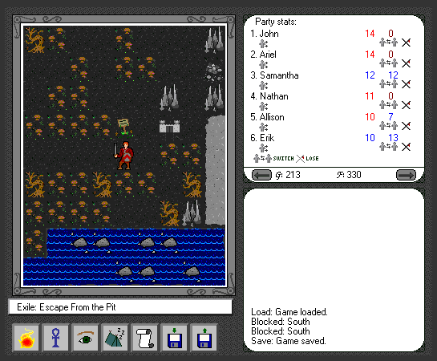
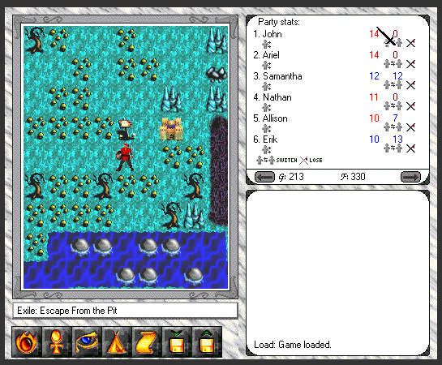

# Exile: Escape From the Pit - Old graphics mod

This repository contains old style graphics which can be used with the
game Exile: Escape From the Pit v2.0
([windows](http://www.spiderwebsoftware.com/exile/winexile.html),
[mac](http://www.spiderwebsoftware.com/exile/macexile.html)). Simply
replace the graphics in your existing Exile directory, and you are
good to go!

The mod uses graphics from different versions of Exile, where I've
simply gone with my gut feeling of what feel "best" (or at least gives
the most feeling of nostalgia).

# Sample comparisons

Here's the graphics with the mod active:

... and here is the same scene with the unmodified/vanilla version:

# How to do a mod yourself

If you want to do the same thing yourself (but more to your personal
liking), you can get the data from the various versions available at
[macintoshgarden](https://macintoshgarden.org/games/exile-escape-from-the-pit).

By using tools such as [unar][https://theunarchiver.com/command-line]
for the `.sit` files, and
[rsrcdump](https://github.com/jorio/rsrcdump) for the `.rsrc` ones,
it's possible to extract the graphics without installing the games.

